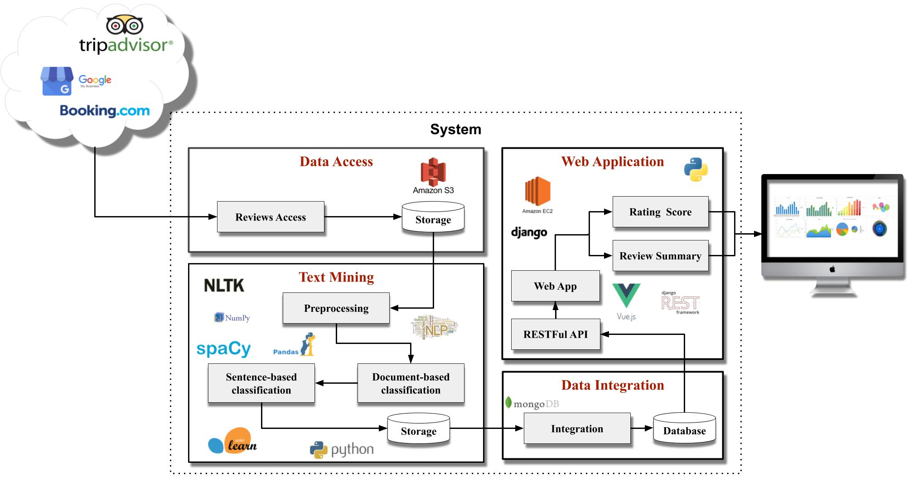

# SARating

## What's SARating?
**SARating** is a service ranking system based on results from sentiment analysis techniques.

The classification is applied to reviews collected from different online platforms. 
The results obtained, are displayed in the form of the sorted list using the [Lower bound of Wilson score confidence interval for a Bernoulli parameter](http://www.evanmiller.org/how-not-to-sort-by-average-rating.html) formula.                          

This approach balances the proportion of positive ratings with the possibility of dealing with small sample sizes. 
The system avoids the need, for the users, to search for online feedback before making decisions.

## Architecture
